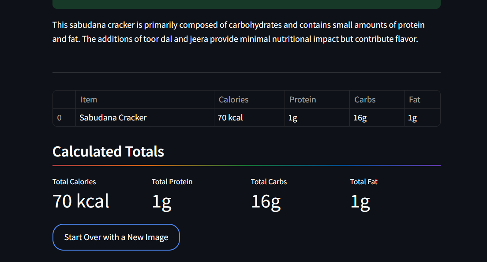

# 🧠 Intelligent AI Calorie Estimator

A smart, image-based food calorie and nutrition estimator built using [Gemini 1.5 Pro](https://deepmind.google/discover/blog/google-gemini-next-generation-models/). 
Upload a photo of your meal, and the AI will analyze it, identify food items, estimate quantities, and ask only the most essential questions before delivering a personalized calorie and macronutrient breakdown.

---

## 📸 Demo

---

## 🚀 Features

✅ Upload a photo of any meal  
✅ Gemini 1.5 Pro performs visual analysis + inference  
✅ Chain-of-thought reasoning with follow-up questioning  
✅ Fat-smart estimation logic (pan-frying, deep-frying attribution)  
✅ Clean, interactive Streamlit interface  
✅ Final JSON-based macro breakdown per item  
✅ Total meal calories, protein, carbs, and fat  
✅ Optimized prompt engineering for Gemini's strengths

---

## 🔧 Tech Stack

- **Frontend:** Streamlit  
- **AI Backend:** Google Gemini 1.5 Pro API  
- **Language:** Python 3.11  
- **Model Prompting:** Chain-of-Thought + Few-shot examples  
- **Deployment Ready:** Streamlit Sharing 

---

## 🧪 How It Works

1. **Upload Meal Photo:**  
   The app uses Streamlit to capture an image.

2. **Visual Analysis (Gemini 1.5 Pro):**  
   The AI:
   - Identifies food components
   - Estimates portions using visual scale cues
   - Assigns confidence scores
   - Generates clarifying questions only when needed

3. **User Answers Questions:**  
   You provide additional context (e.g., how much chicken was used, type of oil, etc.).

4. **Final Nutritional Breakdown:**  
   The AI calculates:
   - Calories
   - Protein
   - Carbohydrates
   - Fat  
   for each item and totals them.

---

